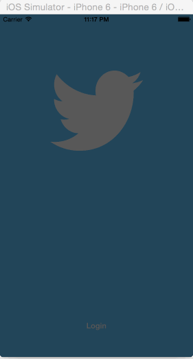

# Twitter-Redux-Demo-Client-iOS-app
Adding Animations like hamburger menu to twitter app developed in the previous assigment

### Time Spent : 15 hours

### Completed user Stories

- Hamburger menu
- [x] Required : Dragging anywhere in the view should reveal the menu.
- [x] Required : The menu should include links to your profile, the home timeline, and the mentions view.
- [x] Required : The menu can look similar to the LinkedIn menu below or feel free to take liberty with the UI.

- [x] Required : Profile page
- [x] Required : Contains the user header view
- [x] Required : Contains a section with the users basic stats: # tweets, # following, # followers
- [ ] Optional : Implement the paging view for the user description.
- [ ] Optional : As the paging view moves, increase the opacity of the background screen. See the actual Twitter app for this effect
- [ ] Optional : Pulling down the profile page should blur and resize the header image.

- [x] Required : Home Timeline
- [x] Required : Tapping on a user image should bring up that user's profile page
- [ ] Optional : Account switching
- [ ] Optional : Long press on tab bar to bring up Account view with animation
- [ ] Optional : Tap account to switch to
- [ ] Optional : Include a plus button to Add an Account
- [ ] Optional : Swipe to delete an account

### Notes :

### Questions :
* After the new view appears on the view controller the navigator bar items resize. how to avoid that?
* Whats the difference between addchildcontroller and addsubview

### References
* Working with gesture recognizers [github](https://github.com/codepath/objc_ios_guides/wiki/Working-with-gesture-recognizers)
* Event handling guide [apple] (https://developer.apple.com/library/ios/documentation/EventHandling/Conceptual/EventHandlingiPhoneOS/GestureRecognizer_basics/GestureRecognizer_basics.html#//apple_ref/doc/uid/TP40009541-CH2-SW44)

### Video Walkthrough

# Twitter-Demo-Client-iOS-app
Simple Twitter Client Demo iOS App

This is a Simple Twitter Client that allows your to read your timeline, create tweets, fav, retweet, reply to tweets. 
The idea was to get introduced to OAuth, Storing User seesions, Auto Layout, Get and Post methods, handling Buttons in tableViewCells.

### Time Spent : 15 hours

### Completed user Stories

- [x] Required : User can sign in using OAuth login flow
- [x] Required : User can view last 20 tweets from their home timeline
- [x] Required : The current signed in user will be persisted across restarts
- [x] Required : In the home timeline, user can view tweet with the user profile picture, username, tweet text, and timestamp. In other words, design the custom cell with the proper Auto Layout settings. You will also need to augment the model classes.
- [x] Required : User can pull to refresh
- [x] Required : User can compose a new tweet by tapping on a compose button.
- [x] Required : User can tap on a tweet to view it, with controls to retweet, favorite, and reply.

- [x] Optional: When composing, you should have a countdown in the upper right for the tweet limit.
- [ ] Optional: After creating a new tweet, a user should be able to view it in the timeline immediately without refetching the timeline from the network.
- [x] Optional: Retweeting and favoriting should increment the retweet and favorite count.
- [x] Optional: User should be able to unretweet and unfavorite and should decrement the retweet and favorite count.
- [x] Optional: Replies should be prefixed with the username and the reply_id should be set when posting the tweet,
- [ ] Optional: User can load more tweets once they reach the bottom of the feed using infinite loading similar to the actual Twitter client

### Notes :

### Questions :
* How doe you reload just a particular cell in the table view, when a fav button is clicked on the cell from table view, the fav image or count should change. how to avoid reload data.
* a delegate on teh cell object needs to be called on awakenib & onFav and onREply, why so ?
* The char count for tweet is a button item. Is there a better way?
* is there a better way to pass the New Tweet back 2 levels views down than a delegate?
* Tweet model can make Client Calls?
* whats mantle?

### References
* Free iOS icons [glyphish](http://www.glyphish.com/)

### VideoWalkthroughs
* This [walkthrough](http://vimeo.com/107373841) takes you through the OAuth 1.0a authentication flow. At the end of this video, you'll be able to download tweets.
* This [walkthrough] (http://vimeo.com/107378059) shows you a pattern for saving the current user as well as firing and handling session events like signing in and signing out.

### Video Walkthrough

GIF created with [LiceCap](http://www.cockos.com/licecap/).
